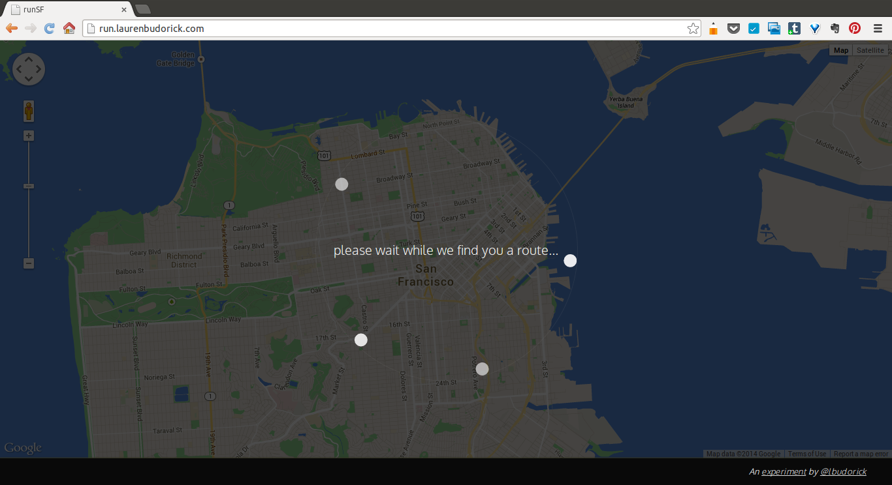
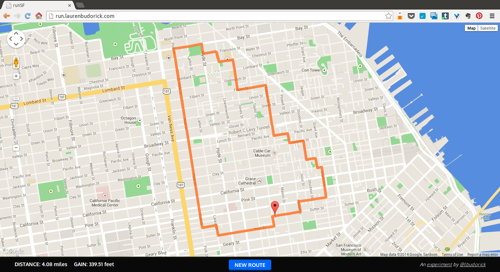

# Run SF

An app to generate flat running routes in San Francisco.  
A blog post on the development process can be found [here][blog post].


## Overview

* Parsed XML data download of OpenStreetMap map of SF into a map graph
* Used Google Elevation API to get elevation data for all intersections
* Stored all graph data in PostgreSQL database with PostGIS extension for
  geospatial querying; used SQLAlchemy and GeoAlchemy to interact with DB 
* Modified [A\* pathfinding algorithm][A\*]
* Single-page app built on Python/Flask and JavaScript/AJAX
* Deployed using DigitalOcean VPS


## Modified A\* Algorithm

I started my [pathfinding algorithm](utils/pathfinding.py) by implementing A\*
in its classic incarnation, so that it could simply find a path from A to B. In
A\*, a node that may be along a path is scored using

```
f(n) = g(n) + h(n)
```

where `g(n)` is the cost to arrive at a node from the start, and `h(n)` is the
estimated heuristic cost from a node to the end.

Once I understood that, I added elevation data so that elevation changes were
proportionally more costly, so that whereas before, for example, a route from
Van Ness and Lombard to Green Street at the Embarcadero was going over Russian
Hill and Telegraph Hill, now it was avoiding the hills and routing north
around them (Bay Street). Essentially at this point my A\* score function was

```
f(n) = g(n) + h(n) + elevation_weight
```

My problem then was that A* works to find routes from A to B, but I wanted to
find routes from A to A with an X-mile detour.

I realized I could modify A* heavily so that, given no end point, I could
invert the geodesic distance from the start to a given node (and give it a
significant multiplier) so that it was more costly to stay closer to the start,
and therefore the pathfinding would just find somewhere in the general
direction of "away." This became a key part of my "explore" score function,
which was essentially

```
f(n) = elevation_weight + α * 1/distance_from_start
```

Then after covering ~40% of the intended distance, the pathfinder should turn
around and find its way back. At that point the score function changes to be
more like a traditional A\* algorithm, with elevation factored in. The one
issue I had here was that I wanted to sometimes make nice running *loops*, not
retrace my own steps, so I added another weight into the scoring function that
calculated the distance from any node to the nearest node on the outbound path,
inverted that, and multiplied it by the distance to the end point (which at
this point is the start point). In doing so it makes it costlier to stay near
the path already taken until it gets closer to the end, when it gradually gets
less expensive to approach and finish the loop. Here, then, the score function
looks like

```
f(n) = elevation_weight + g(n) + h(n) + (h(n) * 1/distance_to_previous_path)
```

…with lots of α multipliers throughout. I'm still tweaking the coefficients and
cost factors here, but the app is generating nice, relatively flat loops at
this point.


## Design

Having been, in my past life, a UX designer, I wanted to choose a project
where, given my time constraints and inability to really do independent user
research, I really understood my user. The convenient thing about building this
app is that the user I had in mind was, in fact, myself. Some highlights of my
design process on this project are as follows:

* A custom Google map. Much of Google's map data is irrelevant to runners
  (transit info, business labels, freeways, etc.) so I stripped lots of
  irrelevant data from the map and customized colors to make it look really
  clean.
* A single-page, jQuery-powered app that would post requests using AJAX and
  show a CSS3 loader in the meantime, since some routes may take a while to
  render; status messages are shown so the user isn't left wondering what's
  going on. Returned data is then rendered using JavaScript on top of the
  existing map so that transitions are as seamless as possible.
* A new route can be generated with just the button in the lower right corner,
  so there's no page reload. ESC intuitively escapes the form overlay to go
  back to just viewing the route if a user changes their mind or clicked the
  button on accident.

One challenge I did run into in design was that I kept finding these strange
little loops. At first I thought it may be a problem with my algorithm, but
then I realized that it was actually Google's DirectionsService API, which
sends a user (even in walking directions) to make U-turns around the block if
given coordinates slightly off an expected path. At that point I reseeded my
database to include a PostgreSQL array of all nodes between each intersection
so that in generating a list of coordinates from a list of intersection
objects, a route object would also query the database for all nodes between
intersections. In this way I was able to draw much nicer polylines without
using the DirectionsService API.

### Screenshots

*Starting screen*


*Loader*


*Rendered route*


*New route generation without page reload*

## Improvements / Future Features

* Subtly animated dot that runs quickly along the polyline to indicate
  directionality.
* Integrate crime data and weigh it heavily in both cost functions so that
  routes avoid high-crime areas.
* User profiles with the ability to save routes.
* A slider that allows a user to place nodes along a representation of the
  distance of a run and drag them up and down to add hill preferences (e.g.
  medium-difficulty hill in the first part of a run). This data would be passed
  as variables into the score functions.
* Integration with running apps (MapMyRun, RunKeeper) to export routes.
* Elevation graph to display elevation changes along rendered route.

I also plan to continue tweaking the score functions to perfect the wayfinding
algorithm.

## Deployment

Run SF is deployed at [run.laurenbudorick.com][site]. In the meantime, a
front-end demo with a single route hard-coded in is available in the
[/demo](demo/) directory.

[blog post]: http://laurenbudorick.tumblr.com/post/82828993995/hackbright-almost-the-end
[site]: http://run.laurenbudorick.com
[A\*]: http://en.wikipedia.org/wiki/A*_search_algorithm
